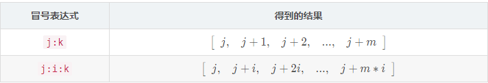

### 一、基本的数学运算与矩阵运算

:video_game:对应学习视频：https://www.bilibili.com/video/BV1GJ41137UH

#### 1、matlab基本语法

##### 变量

- matlab中的变量不需要声明
- 使用`=`为变量赋值


##### 变量名

- 与大多数编程语言相同，matlab中的变量名是大小写敏感的
- 变量名只能由字母、数字、下划线组成且不能以数字开头


##### 不适合做变量名的keywords和内建函数

- 变量名不应该覆盖内建函数名，在matlab中变量的调用优先级高于函数，因此变量名不应该覆盖内置函数

    

    ```matlab
    cos = 'This is a test';
    % 对字符串进行索引取值，得到'a'
    cos(9)
    ```

    若某函数被变量名覆盖，则调用`clear <变量名`可以取消绑定在该函数上的变量名或者在`workspace`中删除对应的栏目！

    ```matlab
    % 清除绑定在cos上的变量
    clear cos
    % 调用内置的余弦函数运算得到-0.1455
    cos(8)
    ```

    注意：`clear`是一个比较危险的命令，因为此命令后若不加参数，则表示清除当前工作区内的所有变量！

    

- 一些有特殊意义的单词不适合做变量名：

    

- `keywords`不适合做变量名：

    


##### 变量类型

matlab中的变量类型有：`logical,char,numeric,cell,struct`等以及它们组成的数组或者矩阵！


##### 数字型变量的显示格式

我们直接定义的数字型变量，默认是以`short`类型显示的！

可以通过`format <显示格式>`改变数字型变量的显示格式


注意：`format <显示格式>`只能在本次工程中有效，下次重启后又会恢复成默认！

要永久修改则需要在`preference`中修改：


##### matlab命令行

- 使用行尾`;`抑制输出，在一行命令后使用`;`抑制输出，否则运算结果将被显示在终端上！

- 其他实用的命令

    

    `clc`就可以理解为清屏，类似于Windows下的`cls`和Linux下的`clear`

    `whos`将工作区的变量以及类型等信息显示出来！


#### 2、使用matlab进行数字运算

##### 使用matlab计算数学表达式

- matlab常见的运算符有：`+,-,*,/,^`等

- 数学表达式被计算后，其值被存入变量`ans`

- 运算的优先级规则：

    ```
    1)同等优先级下从左向右运算
    2)优先级顺序(从高到低)：
    	①：括号()
    	②：幂^
    	③：乘除法*,/
    	④：加减法+,-
    ```

    相关示例如下图：

    

注意：在matlab下`log`就代表`ln`运算


##### matlab内置的数学函数

- MATLAB内置的算数运算函数:
    - 加：`+`,`sum`,`cumsum`,`movsum`
        减：` -`,`diff`
        乘：` .*`,`*`,`prod`,`cumprod`
        除：` ./`,`.\`,`/`,`\`
        乘方：` .^`,`^`
    - 取模运算: `mod`,`rem`,`idivide`,`ceil`,`fix`,`floor`,`round`

- MATLAB内置的三角运算函数
    - 正弦: `sin`,`sind`,`sinpi`,`asin`,`asind`,`sinh`,`asinh`
        余弦: `cos`,`cosd`,`cospi`,`acos`,`acosd`,`cosh`,`acosh`
        正切: `tan`,`tand`,`atan`,`atand`,`atan2`,`atan2d`,`tanh`,`atanh`
        余割: `csc`,`cscd`,`acsc`,`acscd`,`csch`,`acsch`
        正割: `sec`,`secd`,`asec`,`asecd`,`sech`,`asech`
        余切: `cot`,`cotd`,`acot`,`acotd`,`coth`,`acoth`
        斜边: `hypot`
        转换: `deg2rad`,`rad2deg`,`cart2pol`,`cart2sph`,`pol2cart`,`sph2cart`
- MATLAB内置的指数对数函数: `exp`,`expm1`,`log`,`log10`,`log1p`,`log2`,`nextpow2`,`nthroot`,`pow2`,`reallog`,`realpow`,`realsqrt`,`sqrt`
- MATLAB内置的复函数: `abs`,`angle`,`complex`,`conj`,`cplxpair`,`i`,`imag`,`isreal`,`j`,`real`,`sign`,`unwrap`


#### 3、使用matlab进行矩阵运算

##### 定义矩阵

- 向终端输入矩阵

    在matlab中，使用`[]`将待输入的矩阵内容括起来，使用空格或者逗号`,`分隔行内变量，使用`;`分隔每一行

    

- 使用冒号运算符`:`可以创建一个长向量，其语法如下：

    

    下面是具体示例：

    

- 定义特殊矩阵：

    是线代中一些常见的矩阵

    


##### 矩阵的索引

- matlab中的矩阵式以`列先序`存储的，且索引下标从1开始

- 矩阵有两种索引方式，按照一维索引和二维索引，对于一个一般的矩阵，其索引顺序如下：

    

- 矩阵的索引可以使用冒号`:`，表示选取所有的行或者所有的列

- 矩阵的索引可以是与一个或者两个向量，表示选中向量内的所有行和所有列

    如下是矩阵的索引规则：

    


##### 矩阵的操作

- 操作矩阵的运算符：

    

- 操作矩阵的函数：

    示例矩阵如下：
    $$
    A=\left[\begin{array}{lll}
    1 & 2 & 3 \\
    0 & 5 & 6 \\
    7 & 0 & 9
    \end{array}\right]
    $$
    

    对于上面这些函数,除第一个参数以外,其它参数都是可选的.