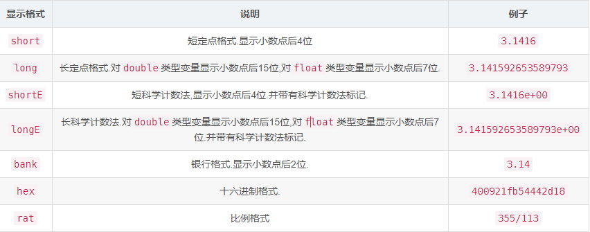
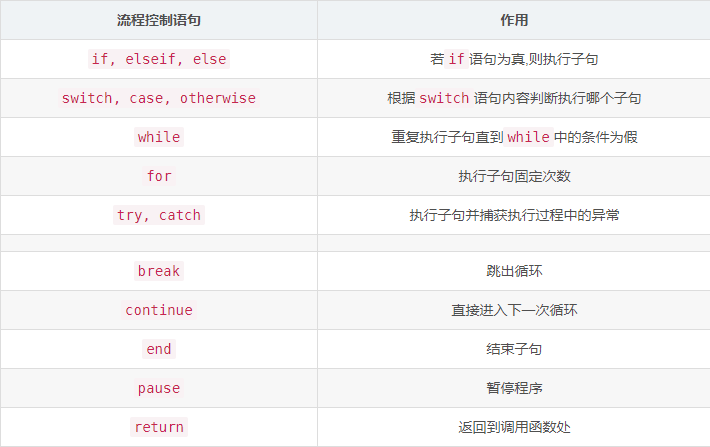

### 一、基本的数学运算与矩阵运算

:video_game:对应学习视频：https://www.bilibili.com/video/BV1GJ41137UH

#### 1、matlab基本语法

##### 变量

- matlab中的变量不需要声明
- 使用`=`为变量赋值


##### 变量名

- 与大多数编程语言相同，matlab中的变量名是大小写敏感的
- 变量名只能由字母、数字、下划线组成且不能以数字开头


##### 不适合做变量名的keywords和内建函数

- 变量名不应该覆盖内建函数名，在matlab中变量的调用优先级高于函数，因此变量名不应该覆盖内置函数

    

    ```matlab
    cos = 'This is a test';
    % 对字符串进行索引取值，得到'a'
    cos(9)
    ```

    若某函数被变量名覆盖，则调用`clear <变量名`可以取消绑定在该函数上的变量名或者在`workspace`中删除对应的栏目！

    ```matlab
    % 清除绑定在cos上的变量
    clear cos
    % 调用内置的余弦函数运算得到-0.1455
    cos(8)
    ```

    注意：`clear`是一个比较危险的命令，因为此命令后若不加参数，则表示清除当前工作区内的所有变量！

    

- 一些有特殊意义的单词不适合做变量名：

    

- `keywords`不适合做变量名：

    


##### 变量类型

matlab中的变量类型有：`logical,char,numeric,cell,struct`等以及它们组成的数组或者矩阵！


##### 数字型变量的显示格式

我们直接定义的数字型变量，默认是以`short`类型显示的！

可以通过`format <显示格式>`改变数字型变量的显示格式



注意：`format <显示格式>`只能在本次工程中有效，下次重启后又会恢复成默认！

要永久修改则需要在`preference`中修改：


##### matlab命令行

- 使用行尾`;`抑制输出，在一行命令后使用`;`抑制输出，否则运算结果将被显示在终端上！

- 其他实用的命令

    

    `clc`就可以理解为清屏，类似于Windows下的`cls`和Linux下的`clear`

    `whos`将工作区的变量以及类型等信息显示出来！


#### 2、使用matlab进行数字运算

##### 使用matlab计算数学表达式

- matlab常见的运算符有：`+,-,*,/,^`等

- 数学表达式被计算后，其值被存入变量`ans`

- 运算的优先级规则：

    ```
    1)同等优先级下从左向右运算
    2)优先级顺序(从高到低)：
    	①：括号()
    	②：幂^
    	③：乘除法*,/
    	④：加减法+,-
    ```

    相关示例如下图：

    

注意：在matlab下`log`就代表`ln`运算


##### matlab内置的数学函数

- MATLAB内置的算数运算函数:
    - 加：`+`,`sum`,`cumsum`,`movsum`
        减：` -`,`diff`
        乘：` .*`,`*`,`prod`,`cumprod`
        除：` ./`,`.\`,`/`,`\`
        乘方：` .^`,`^`
    - 取模运算: `mod`,`rem`,`idivide`,`ceil`,`fix`,`floor`,`round`

- MATLAB内置的三角运算函数
    - 正弦: `sin`,`sind`,`sinpi`,`asin`,`asind`,`sinh`,`asinh`
        余弦: `cos`,`cosd`,`cospi`,`acos`,`acosd`,`cosh`,`acosh`
        正切: `tan`,`tand`,`atan`,`atand`,`atan2`,`atan2d`,`tanh`,`atanh`
        余割: `csc`,`cscd`,`acsc`,`acscd`,`csch`,`acsch`
        正割: `sec`,`secd`,`asec`,`asecd`,`sech`,`asech`
        余切: `cot`,`cotd`,`acot`,`acotd`,`coth`,`acoth`
        斜边: `hypot`
        转换: `deg2rad`,`rad2deg`,`cart2pol`,`cart2sph`,`pol2cart`,`sph2cart`
- MATLAB内置的指数对数函数: `exp`,`expm1`,`log`,`log10`,`log1p`,`log2`,`nextpow2`,`nthroot`,`pow2`,`reallog`,`realpow`,`realsqrt`,`sqrt`
- MATLAB内置的复函数: `abs`,`angle`,`complex`,`conj`,`cplxpair`,`i`,`imag`,`isreal`,`j`,`real`,`sign`,`unwrap`


#### 3、使用matlab进行矩阵运算

##### 定义矩阵

- 向终端输入矩阵

    在matlab中，使用`[]`将待输入的矩阵内容括起来，使用空格或者逗号`,`分隔行内变量，使用`;`分隔每一行

    

- 使用冒号运算符`:`可以创建一个长向量，其语法如下：

    

    下面是具体示例：

    

- 定义特殊矩阵：

    是线代中一些常见的矩阵

    


##### 矩阵的索引

- matlab中的矩阵式以`列先序`存储的，且索引下标从1开始

- 矩阵有两种索引方式，按照一维索引和二维索引，对于一个一般的矩阵，其索引顺序如下：

    

- 矩阵的索引可以使用冒号`:`，表示选取所有的行或者所有的列

- 矩阵的索引可以是与一个或者两个向量，表示选中向量内的所有行和所有列

    如下是矩阵的索引规则：

    


##### 矩阵的操作

- 操作矩阵的运算符：

    

- 操作矩阵的函数：

    示例矩阵如下：
    $$
    A=\left[\begin{array}{lll}
    1 & 2 & 3 \\
    0 & 5 & 6 \\
    7 & 0 & 9
    \end{array}\right]
    $$
    

    对于上面这些函数,除第一个参数以外,其它参数都是可选的.


### 二、结构化编程和函数定义

#### 1、流程控制语句和逻辑运算符

与大多数编程语言相同，matlab有如下流程控制语句：



> 注意：上述所有循环和条件语句都要在末尾以end闭合


matlab还有以下关系运算符：


> 注意：&&和||支持逻辑短路功能


#### 2、流程控制语句示例

下面演示各流程控制语句：

##### if语句


```matlab
a = 10;
% rem(a,2)意思是a和2取余
if rem(a,2) == 0
	disp('a is even');
else
	disp('a is odd')
end
```


##### switch语句


```matlab
% 使用switch多分支选择语句
input_num = 2;
switch input_num
    case -1
        disp('negative 1');
    case 0
        disp('zero')
    case 1
        disp('positive 1')
    otherwise
        disp('other value')
end
```


##### while语句


```matlab
% 使用while循环语句，prod(1:n)是求n!

n = 1;
while prod(1:n) < 1e100
    n = n + 1;
end
disp(n);
```


##### for语句


```matlab
% 使用for循环语句

for n = 1:10
    a(n) = 2^n;
end
disp(a);
```


##### break语句

```matlab
% 使用break语句跳出循环

x = 2;k = 0;error = inf;
error_threshold = 1e-32;

while error > error_threshold
    if k > 100
        break
    end
    x = x - sin(x)/cos(x);
    error = abs(x - pi);
    k = k + 1;
end
```


#### 3、使用循环语句应尽量预先分配内存空间

若一个变量所需要的内存空间是一个可预测的定值，我们应尽量提前为其分配内存空间，以下面两段程序为例演示这一点：

```matlab
% 比较两段程序的运行时间
%% 程序一：循环语句无提前分配内存空间
tic
for ii = 1:2000
    for jj = 1:2000
        A(ii,jj) = ii + jj;
    end
end
toc

%% 程序二：循环语句提前分配内存空间
tic
A = zeros(2000,2000);
for ii = 1:size(A,1)
    for jj = 1:size(A,2)
        A(ii,jj) = ii + jj;
    end
end
toc
```

分别运行当前节之后：


可以看到，前一节程序比后一节程序所用的时间更长，这是因为：对于程序一，没有预先为变量A分配内存，因此每当A的形状发生改变时，都需要重新为A分配内存地址，这花费了更多的时间！


#### 4、编写脚本应注意的问题

- 在脚本开头应添加语句清空工作区

    在每个脚本的开头，应添加下述语句，清空工作区缓存以及之前程序运行的痕迹

    ```matlab
    clear all		% 清空工作区内存中的变量
    close all		% 关闭之前程序绘制的图像
    clc				% 清空之前程序在终端的输出
    ```

- 在运算和赋值语句后应添加分号`;`抑制输出

    在所有运算和赋值语句都应该添加分号`;`抑制输出，若需要向终端输出一个变量，应对其调用`disp`方法

- 使用省略号`...`拼接多行语句

    在matlab中，省略号`...`可以将多行语句拼接成一行，灵活使用该语句可以提高代码可读性

    ```matlab
    annPoints_sampled = annPoints(annPoints(:,1)>x1 & ...
        annPoints(:,1) < x2 & ...
        annPoints(:,2) > y1 & ...
        annPoints(:,2) < y2);
    ```


#### 5、函数

与其他语言相似，matlab也可以定义函数，与脚本类似，函数可以被存入`函数名.m`文件中，也可以以函数句柄的形式定义在内存中！


##### 查看内置函数

可以使用`which`命令查看内置函数源代码文件的位置，与`edit`命令结合可以查看内置函数的源代码

运行下面语句可以打开matlab内置的`mean`函数的源文件

`edit(which('mean.m'))`

可以在编辑器中看到`mean`函数的源代码如下：


##### 以函数名.m文件形式定义函数

在matlab文件中定义函数的格式如下：

```matlab
function [输出变量名] = 函数名(输入变量名)
% 函数的文档

函数代码
```

- `function`是一个关键字，声明该文件中保存的是一个函数
- `输入变量`和`输出变量`是非必须的，函数既可以没有输入变量，也可以没有输出变量
- `函数名`应与`.m`文件名相同，且不包含特殊字符(最好不要有中文)


##### matlab内置的函数参数

在matlab中内置了一些函数参数如下：


matlab不提供其他高级语言的指定默认参数值以及函数重载等语法，但灵活使用上述内置的函数参数可以在一定程度上实现指定默认参数值以及方法重载：

```matlab
function [volume] = pillar(Do,Di,height)
if nargin == 2
	height = 1
end
volume = abs(Do.^2 - Di.^2).*height*pi/4;
```


#### 6、matlab函数定义示例

下面计算自由落体运动中的位移量：
$$
x=x_{0}+v_{0} t+\frac{1}{2} g t^{2}
$$

```matlab
function x = freebody(x0,v0,t)
% calculation of free falling
% x0:initial displacement in m
% v0:initial velocity in m/sec
% x:the depth of falling in m
% t:the elapsed time in sec
x = x0 + v0 .* t + 1/2*9.8*t.* t;
```

该函数演示了一个matlab编程技巧: 计算乘法时应尽量使用`.*`而非`*`,因为前者不仅对参数`t`为标量的情况可用,也对变量`t`为向量或矩阵的情况可用.

如下图：


下面函数实现了从华氏温度到摄氏温度的转换,该函数可以识别输入的待转换样例的个数,当输入的待转换样例个数为0时,退出函数.

```matlab
function F2C()
while 1
	% 表示输入字符串：https://blog.csdn.net/yewuzhitou/article/details/81906379
    F_degree = input('tempreature in Fahrenheit: ', 's');
    % 字符串转数字：https://blog.csdn.net/qq_41144863/article/details/101025605
    F_degree = str2num(F_degree);
    % 确定数组是否是空https://ww2.mathworks.cn/help/matlab/ref/isempty.html
    if isempty(F_degree)
        return
    end
    C_degree = (F_degree-32)*5/9;
    % 字符串拼接：https://blog.csdn.net/largestone_187/article/details/6000254
    disp(['tempreature in Celsius: ' num2str(C_degree)])
end
```

> disp出来的是一个包含两个element的向量，第一个是那个string，第二个是这个variable，两个之间用空格分开，或者你也可以用“，”


#### 7、以函数句柄形式定义函数

可以使用函数句柄形式定义函数，这更接近数学上的函数定义，其语法如下：

`函数句柄 = @(输入变量) 输出变量`

可以通过函数句柄调用该方法：

