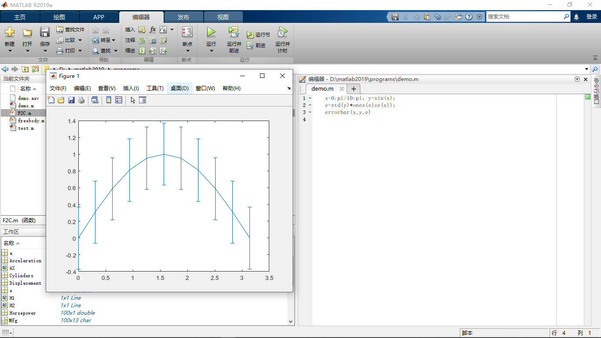

### 一、基本的数学运算与矩阵运算

:video_game:对应学习视频：https://www.bilibili.com/video/BV1GJ41137UH

#### 1、matlab基本语法

##### 变量

- matlab中的变量不需要声明
- 使用`=`为变量赋值


##### 变量名

- 与大多数编程语言相同，matlab中的变量名是大小写敏感的
- 变量名只能由字母、数字、下划线组成且不能以数字开头


##### 不适合做变量名的keywords和内建函数

- 变量名不应该覆盖内建函数名，在matlab中变量的调用优先级高于函数，因此变量名不应该覆盖内置函数

    

    ```matlab
    cos = 'This is a test';
    % 对字符串进行索引取值，得到'a'
    cos(9)
    ```

    若某函数被变量名覆盖，则调用`clear <变量名`可以取消绑定在该函数上的变量名或者在`workspace`中删除对应的栏目！

    ```matlab
    % 清除绑定在cos上的变量
    clear cos
    % 调用内置的余弦函数运算得到-0.1455
    cos(8)
    ```

    注意：`clear`是一个比较危险的命令，因为此命令后若不加参数，则表示清除当前工作区内的所有变量！

    

- 一些有特殊意义的单词不适合做变量名：

    

- `keywords`不适合做变量名：

    


##### 变量类型

matlab中的变量类型有：`logical,char,numeric,cell,struct`等以及它们组成的数组或者矩阵！


##### 数字型变量的显示格式

我们直接定义的数字型变量，默认是以`short`类型显示的！

可以通过`format <显示格式>`改变数字型变量的显示格式


注意：`format <显示格式>`只能在本次工程中有效，下次重启后又会恢复成默认！

要永久修改则需要在`preference`中修改：


##### matlab命令行

- 使用行尾`;`抑制输出，在一行命令后使用`;`抑制输出，否则运算结果将被显示在终端上！

- 其他实用的命令

    

    `clc`就可以理解为清屏，类似于Windows下的`cls`和Linux下的`clear`

    `whos`将工作区的变量以及类型等信息显示出来！


#### 2、使用matlab进行数字运算

##### 使用matlab计算数学表达式

- matlab常见的运算符有：`+,-,*,/,^`等

- 数学表达式被计算后，其值被存入变量`ans`

- 运算的优先级规则：

    ```
    1)同等优先级下从左向右运算
    2)优先级顺序(从高到低)：
    	①：括号()
    	②：幂^
    	③：乘除法*,/
    	④：加减法+,-
    ```

    相关示例如下图：

    

注意：在matlab下`log`就代表`ln`运算


##### matlab内置的数学函数

- MATLAB内置的算数运算函数:
    - 加：`+`,`sum`,`cumsum`,`movsum`
        减：` -`,`diff`
        乘：` .*`,`*`,`prod`,`cumprod`
        除：` ./`,`.\`,`/`,`\`
        乘方：` .^`,`^`
    - 取模运算: `mod`,`rem`,`idivide`,`ceil`,`fix`,`floor`,`round`

- MATLAB内置的三角运算函数
    - 正弦: `sin`,`sind`,`sinpi`,`asin`,`asind`,`sinh`,`asinh`
        余弦: `cos`,`cosd`,`cospi`,`acos`,`acosd`,`cosh`,`acosh`
        正切: `tan`,`tand`,`atan`,`atand`,`atan2`,`atan2d`,`tanh`,`atanh`
        余割: `csc`,`cscd`,`acsc`,`acscd`,`csch`,`acsch`
        正割: `sec`,`secd`,`asec`,`asecd`,`sech`,`asech`
        余切: `cot`,`cotd`,`acot`,`acotd`,`coth`,`acoth`
        斜边: `hypot`
        转换: `deg2rad`,`rad2deg`,`cart2pol`,`cart2sph`,`pol2cart`,`sph2cart`
- MATLAB内置的指数对数函数: `exp`,`expm1`,`log`,`log10`,`log1p`,`log2`,`nextpow2`,`nthroot`,`pow2`,`reallog`,`realpow`,`realsqrt`,`sqrt`
- MATLAB内置的复函数: `abs`,`angle`,`complex`,`conj`,`cplxpair`,`i`,`imag`,`isreal`,`j`,`real`,`sign`,`unwrap`


#### 3、使用matlab进行矩阵运算

##### 定义矩阵

- 向终端输入矩阵

    在matlab中，使用`[]`将待输入的矩阵内容括起来，使用空格或者逗号`,`分隔行内变量，使用`;`分隔每一行

    

- 使用冒号运算符`:`可以创建一个长向量，其语法如下：

    

    下面是具体示例：

    

- 定义特殊矩阵：

    是线代中一些常见的矩阵

    


##### 矩阵的索引

- matlab中的矩阵式以`列先序`存储的，且索引下标从1开始

- 矩阵有两种索引方式，按照一维索引和二维索引，对于一个一般的矩阵，其索引顺序如下：

    

- 矩阵的索引可以使用冒号`:`，表示选取所有的行或者所有的列

- 矩阵的索引可以是与一个或者两个向量，表示选中向量内的所有行和所有列

    如下是矩阵的索引规则：

    


##### 矩阵的操作

- 操作矩阵的运算符：

    

- 操作矩阵的函数：

    示例矩阵如下：
    $$
    A=\left[\begin{array}{lll}
    1 & 2 & 3 \\
    0 & 5 & 6 \\
    7 & 0 & 9
    \end{array}\right]
    $$
    

    对于上面这些函数,除第一个参数以外,其它参数都是可选的.


### 二、结构化编程和函数定义

#### 1、流程控制语句和逻辑运算符

与大多数编程语言相同，matlab有如下流程控制语句：


> 注意：上述所有循环和条件语句都要在末尾以end闭合


matlab还有以下关系运算符：


> 注意：&&和||支持逻辑短路功能


#### 2、流程控制语句示例

下面演示各流程控制语句：

##### if语句


```matlab
a = 10;
% rem(a,2)意思是a和2取余
if rem(a,2) == 0
	disp('a is even');
else
	disp('a is odd')
end
```


##### switch语句


```matlab
% 使用switch多分支选择语句
input_num = 2;
switch input_num
    case -1
        disp('negative 1');
    case 0
        disp('zero')
    case 1
        disp('positive 1')
    otherwise
        disp('other value')
end
```


##### while语句


```matlab
% 使用while循环语句，prod(1:n)是求n!

n = 1;
while prod(1:n) < 1e100
    n = n + 1;
end
disp(n);
```


##### for语句


```matlab
% 使用for循环语句

for n = 1:10
    a(n) = 2^n;
end
disp(a);
```


##### break语句

```matlab
% 使用break语句跳出循环

x = 2;k = 0;error = inf;
error_threshold = 1e-32;

while error > error_threshold
    if k > 100
        break
    end
    x = x - sin(x)/cos(x);
    error = abs(x - pi);
    k = k + 1;
end
```


#### 3、使用循环语句应尽量预先分配内存空间

若一个变量所需要的内存空间是一个可预测的定值，我们应尽量提前为其分配内存空间，以下面两段程序为例演示这一点：

```matlab
% 比较两段程序的运行时间
%% 程序一：循环语句无提前分配内存空间
tic
for ii = 1:2000
    for jj = 1:2000
        A(ii,jj) = ii + jj;
    end
end
toc

%% 程序二：循环语句提前分配内存空间
tic
A = zeros(2000,2000);
for ii = 1:size(A,1)
    for jj = 1:size(A,2)
        A(ii,jj) = ii + jj;
    end
end
toc
```

分别运行当前节之后：


可以看到，前一节程序比后一节程序所用的时间更长，这是因为：对于程序一，没有预先为变量A分配内存，因此每当A的形状发生改变时，都需要重新为A分配内存地址，这花费了更多的时间！


#### 4、编写脚本应注意的问题

- 在脚本开头应添加语句清空工作区

    在每个脚本的开头，应添加下述语句，清空工作区缓存以及之前程序运行的痕迹

    ```matlab
    clear all		% 清空工作区内存中的变量
    close all		% 关闭之前程序绘制的图像
    clc				% 清空之前程序在终端的输出
    ```

- 在运算和赋值语句后应添加分号`;`抑制输出

    在所有运算和赋值语句都应该添加分号`;`抑制输出，若需要向终端输出一个变量，应对其调用`disp`方法

- 使用省略号`...`拼接多行语句

    在matlab中，省略号`...`可以将多行语句拼接成一行，灵活使用该语句可以提高代码可读性

    ```matlab
    annPoints_sampled = annPoints(annPoints(:,1)>x1 & ...
        annPoints(:,1) < x2 & ...
        annPoints(:,2) > y1 & ...
        annPoints(:,2) < y2);
    ```


#### 5、函数

与其他语言相似，matlab也可以定义函数，与脚本类似，函数可以被存入`函数名.m`文件中，也可以以函数句柄的形式定义在内存中！


##### 查看内置函数

可以使用`which`命令查看内置函数源代码文件的位置，与`edit`命令结合可以查看内置函数的源代码

运行下面语句可以打开matlab内置的`mean`函数的源文件

`edit(which('mean.m'))`

可以在编辑器中看到`mean`函数的源代码如下：


##### 以函数名.m文件形式定义函数

在matlab文件中定义函数的格式如下：

```matlab
function [输出变量名] = 函数名(输入变量名)
% 函数的文档

函数代码
```

- `function`是一个关键字，声明该文件中保存的是一个函数
- `输入变量`和`输出变量`是非必须的，函数既可以没有输入变量，也可以没有输出变量
- `函数名`应与`.m`文件名相同，且不包含特殊字符(最好不要有中文)


##### matlab内置的函数参数

在matlab中内置了一些函数参数如下：


matlab不提供其他高级语言的指定默认参数值以及函数重载等语法，但灵活使用上述内置的函数参数可以在一定程度上实现指定默认参数值以及方法重载：

```matlab
function [volume] = pillar(Do,Di,height)
if nargin == 2
	height = 1
end
volume = abs(Do.^2 - Di.^2).*height*pi/4;
```


#### 6、matlab函数定义示例

下面计算自由落体运动中的位移量：
$$
x=x_{0}+v_{0} t+\frac{1}{2} g t^{2}
$$

```matlab
function x = freebody(x0,v0,t)
% calculation of free falling
% x0:initial displacement in m
% v0:initial velocity in m/sec
% x:the depth of falling in m
% t:the elapsed time in sec
x = x0 + v0 .* t + 1/2*9.8*t.* t;
```

该函数演示了一个matlab编程技巧: 计算乘法时应尽量使用`.*`而非`*`,因为前者不仅对参数`t`为标量的情况可用,也对变量`t`为向量或矩阵的情况可用.

如下图：


下面函数实现了从华氏温度到摄氏温度的转换,该函数可以识别输入的待转换样例的个数,当输入的待转换样例个数为0时,退出函数.

```matlab
function F2C()
while 1
	% 表示输入字符串：https://blog.csdn.net/yewuzhitou/article/details/81906379
    F_degree = input('tempreature in Fahrenheit: ', 's');
    % 字符串转数字：https://blog.csdn.net/qq_41144863/article/details/101025605
    F_degree = str2num(F_degree);
    % 确定数组是否是空https://ww2.mathworks.cn/help/matlab/ref/isempty.html
    if isempty(F_degree)
        return
    end
    C_degree = (F_degree-32)*5/9;
    % 字符串拼接：https://blog.csdn.net/largestone_187/article/details/6000254
    disp(['tempreature in Celsius: ' num2str(C_degree)])
end
```

> disp出来的是一个包含两个element的向量，第一个是那个string，第二个是这个variable，两个之间用空格分开，或者你也可以用“，”


#### 7、以函数句柄形式定义函数

可以使用函数句柄形式定义函数，这更接近数学上的函数定义，其语法如下：

`函数句柄 = @(输入变量) 输出变量`

可以通过函数句柄调用该方法：


### 三、数学类型与文件读写

#### 1、数据类型

matlab中主要的数据类型如下：


##### 数值类型（numeric）

在matlab中，数值类型的变量被默认为`double`类型的，可以使用类型转换为其他数值类型


matlab支持的数值类型如下：


##### 字符串类型（char）

- 在matlab中，字符串类型由一对单引号`''`包裹一段文字来定义，标准ASCII字符可以被转换为对应的ASCII码

    

- 字符串在内存中是以字符矩阵的形式存储的，可以对其进行矩阵的索引以及赋值操作：

    


##### 结构体（structure）

在matlab中，结构体是一个存储`{键:值}`的数据结构，类似于Python中的字典

- 和大多数编程语言类似，matlab使用`.`来访问结构体中的字段

    

    ```matlab
    student.name = 'John Doe';
    student.id = 'jdo2@sfu.ca';
    student.number = 301073268;
    student.grade = [100, 75, 73; ...
                     95, 91, 85.5; ...
                     100, 98, 72];
    student
    ```

    

- 对结构体列表使用下标表达式可以扩充或者缩减结构体列表

    

    ```matlab
    student(2).name = 'Ann Lane';
    student(2).id = 'aln4@sfu.ca';
    student(2).number = 301078853;
    student(2).grade = [95 100 90; 95 82 97; 100 85 100];
    student
    
    student(1) = []		% 删除student列表第一项
    ```

    

- 结构体可以级联，即结构体中字段的取值也可以是结构体

    

    ```matlab
    A = struct('data', [3 4 7; 8 0 1], ...
    	'nest', struct('testnum', 'Test 1', ...
            'xdata', [4 2 8], ...
            'ydata', [7 1 6]));
    A(2).data = [9 3 2; 7 6 5];
    A(2).nest.testnum = 'Test 2';
    A(2).nest.xdata = [3 4 2];
    A(2).nest.ydata = [5 0 9];
    
    A
    ```

    

- 结构体的常用函数

    


##### 元胞数组（cell）

在matlab中，元胞数组是一个可以容纳不同类型元素的数据结构，类似于Python语言中的列表

- 我们可以使用`{}`像定义矩阵一样定义元胞数组：

    

    方式一：

    ```matlab
    A = { [1 4 3; 0 5 8; 7 2 9]		'Anne Smith' ;...
    3+7i		-pi:pi:pi}
    ```

    方式二：

    ```matlab
    A(1,1)={[1 4 3; 0 5 8; 7 2 9]};
    A(1,2)={'Anne Smith'};
    A(2,1)={3+7i};
    A(2,2)={-pi:pi:pi};
    A
    ```

    方式三：

    ```matlab
    A{1,1}=[1 4 3; 0 5 8; 7 2 9];
    A{1,2}='Anne Smith';
    A{2,1}=3+7i;
    A{2,2}=-pi:pi:pi;
    A
    ```

    上面三种方式都是等价的，其中第二种方式使用**单元索引**赋值，而第三种方式使用**内容索引**赋值

- 有两种方式访问元胞数组中的数据，分别是：**单元索引**`()`和**内容索引**`{}`

    因为元胞数组的子集仍为元胞数组，在索引器内容的使用，我们有必要指明我们要访问的是一个**子元胞数组**还是**元胞数组对应区域中的内容**

    - 使用**单元索引**`()`，我们得到的是一个**子元胞数组**
    - 使用**内容索引**`{}`，我们得到的是元胞数组对应区域中的内容

- 元胞数组的常用函数：

    

    其中`mat2cell`函数可以在转换的时候指定元胞数组各元胞的尺寸

    ```matlab
    a = magic(3)
    
    b = num2cell(a)
    % 得到
    % [8] [1] [6]
    % [3] [5] [7]
    % [4] [9] [2]
    
    c = mat2cell(a, [1 2], [2, 1])
    % 得到
    % [1x2 double] [6]
    % [2x2 double] [2x1 double]
    ```

    

- 高维元胞数组

    一个三维的元胞数组可以有**行**（row），**列**（column），**层**（layer）三个维度，在对元胞数组进行索引时，优先级从高到低的顺序分别是：行🔪列🔪层

    

    使用`cat`函数可以在指定维度上对元胞数组进行拼接

    


#### 2、判断变量数据类型的函数

下列函数可以对变量类型进行判断


#### 3、文件读写

- matlab支持的文件类型如下：

    

- 读写matlab格式的数据：

    matlab工作区内的数据可以以`*.mat`格式保存在文件中，使用`save`函数将数据存入文件，使用`load`函数从文件中读取数据

    - `save`函数的语法如下：

        `save(filename,variables)`将变量`variables`以二进制形式存入文件中

        `save(filename,variables,'-ascii')`将变量`variables`以文本形式存入文件中

    - `load`函数的语法如下：

        `load(filename)`从二进制形式文件中读取数据

        `load(filename,'-ascii')`从文本形式文件中读取数据

    其中参数`filename`和`variables`都是字符串格式，若不指定`variables`参数，则将当前工作区内的所有变量存入文件中！

    > 复杂的数据格式，如struct和cell，不支持以二进制格式存储！

- 读写excel表格

    使用`xlsread`和`xlswrite`函数可以读写Excel数据，语法如下:

    - 读Excel文件的语法：`[num,txt,raw] = xlsread(filename,sheet,xlRange)`

        

        ```matlab
        Score = xlsread('04Score.xlsx')
        Score = xlsread('04Score.xlsx', 'B2:D4')
        [Score Header] = xlsread('04Score.xlsx')
        ```

    - 写入Excel的语法：`xlswrite(filename,A,sheet,xlRange)`

        ```matlab
        M = mean(Score)';
        % mean 计算的是矩阵的列向量的均值，而测试例子是把每个人的成绩放在一行，所以要先转置
        xlswrite('04Score.xlsx', M, 1, 'E2:E4');
        xlswrite('04Score.xlsx', {'Mean'}, 1, 'E1');
        ```


### 四、matlab基础绘图

#### 1、图像的绘制与装饰

- 使用`plot()`函数绘制图线，语法为：

    ```matlab
    plot(x,y,LineSpec)
    ```

    其中各参数的意义如下：

    - `x`：图线上点的`x`坐标

    - `y`：图线上点的`y`坐标

    - `LineSpec`: 图线的线条设定,三个指定**线型**,**标记符号**和**颜色**的**设定符**组成一个字符串,设定符不区分先后.具体细节请参考[官方文档](https://www.mathworks.com/help/matlab/ref/linespec.html).

        

    - 下面的例子演示了绘制(0,2*π*)内余弦函数的图像：

        ```matlab
        x = 0:pi/20:2*pi;
        y = cos(x);
        % r.-的意思是：红线、特殊点用.标记，整体用实现连接
        plot(x,y,'r.-')
        ```

        

- 装饰图线

    使用`legend()`函数为图片增加图例

    使用`legend(label1,...labeln)`函数可以为图片添加图例

    ```matlab
    x=0:0.5:4*pi;
    y=sin(x); h=cos(x); w=1./(1+exp(-x)); g=(1/(2*pi*2)^0.5).*exp((-1.*(x-2*pi).^2)./(2*2^2));
    plot(x,y,'bd-' ,x,h,'gp:',x,w,'ro-' ,x,g,'c^-');		% 绘制多条图线
    legend('sin(x)','cos(x)','Sigmoid','Gauss function');	% 添加图例
    ```

    

    使用`title()`和`x/y.label()`为图片增加标题和标签

    ```matlab
    x = 0:0.1:2*pi; y1 = sin(x); y2 = exp(-x);
    plot(x, y1, '--*', x, y2, ':o');
    xlabel('t = 0 to 2\pi');
    % 后面这种如：e^{-x}的是latex语法
    ylabel('values of sin(t) and e^{-x}')
    title('Function Plots of sin(t) and e^{-x}');
    legend('sin(t)','e^{-x}');
    ```

     

    使用`text()`和`annotation()`为图片添加注解

    ```matlab
    x = linspace(0,3); y = x.^2.*sin(x); plot(x,y);
    line([2,2],[0,2^2*sin(2)]);
    str = '$$ \int_{0}^{2} x^2\sin(x) dx $$';
    text(0.25,2.5,str,'Interpreter','latex');
    annotation('arrow','X',[0.32,0.5],'Y',[0.6,0.4]); 
    ```

    

    

#### 2、控制坐标轴、边框与网格

使用下列命令可以控制坐标轴、边框和网络


下面的例子演示了`axis`命令的效果：

```matlab
t = 0:0.1:2*pi; x = 3*cos(t); y = sin(t);
subplot(2, 2, 1); plot(x, y); axis normal
subplot(2, 2, 2); plot(x, y); axis square
subplot(2, 2, 3); plot(x, y); axis equal
subplot(2, 2, 4); plot(x, y); axis equal tight
```


#### 3、绘制多条图线

- 在一个图像上绘制多条图线

    默认情况下，每次执行`plot()`函数都会清除上一次绘图的结果，多次执行`plot()`只会保留最后一次绘制的图形

    ```matlab
    plot(cos(0:pi/20:2*pi));
    plot(sin(0:pi/20:2*pi));
    ```

- 我们可以使用`hold on`和`hold off`命令控制绘图区域的刷新，使得多个绘图结果同时保留在绘图区域中

    ```matlab
    hold on		% 提起画笔,开始绘制一组图片			
    plot(cos(0:pi/20:2*pi));
    plot(sin(0:pi/20:2*pi));
    hold off	% 放下画笔,该组图片绘制完毕
    ```

    


#### 4、在一个窗口内绘制多个图像

使用`subplot()`函数可以在一个窗口内绘制多个图像，其语法如下：

`subplot(m,n,p)`

该命令表示将当前图窗划分为`m`×`n`个网格,并在第`p`个网格内绘制图像.

示例如下：

```matlab
subplot(2,2,1);
x = linspace(-3.8,3.8);
y_cos = cos(x);
plot(x,y_cos);
title('Subplot 1: Cosine')

subplot(2,2,2);
y_poly = 1 - x.^2./2 + x.^4./24;
plot(x,y_poly,'g');
title('Subplot 2: Polynomial')

subplot(2,2,[3,4]);
plot(x,y_cos,'b',x,y_poly,'g');
title('Subplot 3 and 4: Both')
```


#### 5、图形对象的操作

在MATLAB中,图形都是以对象的形式储存在内存中,通过获取其图形句柄可以对其进行操作


- 获取图形句柄

    图形句柄本质上就是一个浮点数,可以唯一确定一个图形对象.下面几个函数用于获取图形句柄.

    

    所有绘图函数也会返回图形对象的句柄

    

    

- 通过图形句柄操作图形属性

    使用`get()`和`set()`函数可以对图形对象的属性进行访问和修改.访问[官方文档](http://www.mathworks.com/help/matlab/ref/figure-properties.html)可以查看所有图形对象的属性.

    - `set(H,Name,Value)`
    - `v = get(h,propertyName)`

    

    下面两个例子演示使用图形句柄操作图形对象:

    - 改变坐标轴属性：

        ```matlab
        % 第一张图
        set(gca, 'FontSize', 25);
        
        % 第二张图
        set(gca, 'XTick', 0:pi/2:2*pi);
        set(gca, 'XTickLabel', 0:90:360);
        
        % 第三张图
        set(gca, 'FontName', 'symbol');
        set(gca, 'XTickLabel', {'0', 'p/2', 'p', '3p/2', '2p'});
        ```

        

    - 改变线型

        ```matlab
        h = plot(x,y); 
        set(h, 'LineStyle','-.', ...
        	'LineWidth', 7.0, ...
        	'Color', 'g');
        ```

        

#### 6、将图形保存到文件

使用`saveas(fig,filename)`命令可以将图形对象保存到文件中,其中`fig`为图形句柄,`filname`为文件名.

`saveas(gcf, 'myfigure.png')`
使用`saveas()`函数将图像保存成位图时,会发生失真.要精确控制生成图片的质量,可以使用`print()`函数,见[官方文档](https://www.mathworks.com/help/matlab/ref/print.html)


### 五、matlab绘制高级图表

#### 1、二维图表

##### 折线图


##### 对数坐标系图线

下面的例子演示了对数坐标系图线：

```matlab
x = logspace(-1,1,100);
y = x.^2;

subplot(2,2,1);
plot(x,y);
title('Plot');

subplot(2,2,2);
semilogx(x,y);
title('Semilogx');

subplot(2,2,3);
semilogy(x,y);
title('Semilogy');

subplot(2,2,4);
loglog(x,y);
title('Loglog');
```

折线图示例：


对数坐标系可以加上**网格**，以区分线性坐标系与对数坐标系

```matlab
set(gca,'XGrid','on');
```

示例图如下：


##### 双y轴图线

`plotyy()`的返回值为数组`[ax,hlines1,hlines2]`，其中：

- `ax`为一个向量，保存两个坐标系对象的句柄
- `hlines1`和`hlines2`分别为两个图线的句柄

```matlab
x = 0:0.01:20;
y1 = 200*exp(-0.05*x).*sin(x);
y2 = 0.8*exp(-0.5*x).*sin(10*x);

[AX,H1,H2] = plotyy(x,y1,x,y2);
set(get(AX(1),'Ylabel'),'String','Left Y-axis');
set(get(AX(2),'Ylabel'),'String','Right Y-axis');

title('Labeling plotyy');
set(H1,'LineStyle','--');
set(H2,'LineStyle',':');
```

示例图如下：


##### 极坐标图线

```matlab
% 螺旋线
x = 1:100; theta = x/10; r = log10(x);
subplot(1,4,1); polar(theta,r);

% 花瓣
theta = linspace(0, 2*pi); r = cos(4*theta);
subplot(1,4,2); polar(theta, r);

% 五边形
theta = linspace(0, 2*pi, 6); r = ones(1,length(theta));
subplot(1,4,3); polar(theta,r);

% 心形线
theta = linspace(0, 2*pi); r = 1-sin(theta);
subplot(1,4,4); polar(theta , r);
```

示例图如下：


##### 统计图表


- 直方图：

    使用`hist()`绘制直方图，语法如下：

    ```matlab
    hist(x,nbins);
    ```

    其中：

    - `x`表示原始数据
    - `nbins`表示分组的个数

    ```matlab
    x = randn(1,1000);
    subplot(2,1,1);
    hist(x,10);
    title('Bins = 10');
    
    subplot(2,1,2);
    hist(x,50);
    title('Bins = 50');
    ```

    示例图如下：

    

    

- 柱状图：

    使用`bar()`和`bar3()`函数分别绘制二维和三维柱状图

    ```matlab
    x = [1,2,5,4,8];
    y = [x;1:5];
    
    subplot(1,3,1);
    bar(x);
    title('A bargraph of vector x');
    
    subplot(1,3,2);
    bar(y);
    title('A bargraph of vector y');
    
    subplot(1,3,3);
    bar3(y);
    title('A 3D bargraph');
    ```

    示例图效果如下：

    

    > hist()主要用于查看变量的频率分布，bar()查看分立的量的统计结果

    使用`barh()`函数可以绘制纵向排列的柱状图

    ```matlab
    x = [1 2 5 4 8];
    y = [x;1:5];
    barh(y);
    title('Horizontal');
    ```

    示例图如下：

    

    向`bar()`传入`stack`参数可以让柱状图以堆栈的形式画出

    ```matlab
    x = [1 2 5 4 8];
    y = [x;1:5];
    bar(y,'stacked');
    title('Stacked');
    ```

    示例图如下：

    

    

- 饼图：

    使用`pie()`和`pie3()`可以绘制二维和三维的饼图，向其中传入一个`bool`向量表示每一部分扇区是否偏移

    ```matlab
    a = [10,5,20,30];
    subplot(1,3,1);
    pie(a);
    
    subplot(1,3,2);
    pie(a,[0,0,0,1]);
    
    subplot(1,3,3);
    pie3(a,[0,0,0,1]);
    ```

    示例图如下：

    

    

- 阶梯图和针状图：绘制离散数字序列

    `starirs()`和`stem()`函数分别用来绘制阶梯图和针状图，用于表示离散数字序列

    ```matlab
    x = linspace(0, 4*pi, 40); y = sin(x);
    subplot(1,2,1); stairs(y);
    subplot(1,2,2); stem(y);
    ```

    示例图如下：

    

    

- 其他统计图表

    `boxplot()`箱型图

    ```matlab
    load carsmall
    boxplot(MPG, Origin);
    ```

    示例图如下：

    

    

    `errorbar()`

    ```matlab
    x=0:pi/10:pi; y=sin(x);
    e=std(y)*ones(size(x));
    errorbar(x,y,e)
    ```

    示例图如下：

    

    


#### 2、绘制图形

matlab可以绘制简单的图形，使用`fill()`函数可以对区域进行填充

```matlab
t =(1:2:15)'*pi/8; x = sin(t); y = cos(t);
fill(x,y,'r'); axis square off;
text(0,0,'STOP','Color', ...
	'w', 'FontSize', 80, ... 
	'FontWeight','bold', ...
	'HorizontalAlignment', 'center');
```

示例图如下：


#### 3、三维图表

##### 二维图转为三维图

在matlab中，所有的图都是三维图，二维图只不过是三维图的一个投影，点击图形窗口的`Rotate 3D`按钮,即可通过鼠标拖拽查看该图形的三维视图.


##### 三维图转为二维图

使用`imagesc()`函数可以将三维图转换为二维俯视图，通过点的颜色指示亮度

```matlab
[x, y] = meshgrid(-3:.2:3,-3:.2:3); z = x.^2 + x.*y + y.^2; 

subplot(1, 2, 1)
surf(x, y, z); 

subplot(1, 2, 2)
imagesc(z);
```


使用`colorbar`命令可以在生成的二维图上增加颜色与高度间的图例，使用`colormap`命令可以改变配色方案


##### 三维图的绘制

- 绘制三维图前的准备工作：使用`meshgrid()`生成二维网格

    我们对一个二维网格矩阵应用函数$$z = f ( x , y ) $$才能得到三维图形,因此在得到三维数据之前我们应当使用meshgrid()函数生成二维网格矩阵.

    `meshgrid()`函数将输入的两个向量进行相应的行扩充和列扩充以得到两个增广矩阵,对该矩阵可应用二元函数.

    ```matlab
    x = -2:1:2;
    y = -2:1:2;
    [X,Y] = meshgrid(x,y)
    Z = X.^2 + Y.^2
    ```

    得到生成的二维网格矩阵如下：

    ```
    X =
        -2    -1     0     1     2
        -2    -1     0     1     2
        -2    -1     0     1     2
        -2    -1     0     1     2
        -2    -1     0     1     2
    
    
    Y =
        -2    -2    -2    -2    -2
        -1    -1    -1    -1    -1
         0     0     0     0     0
         1     1     1     1     1
         2     2     2     2     2
         
    Z =
         8     5     4     5     8
         5     2     1     2     5
         4     1     0     1     4
         5     2     1     2     5
         8     5     4     5     8
    ```

    

- 绘制三维线

    使用`plot3()`函数即可绘制三维面，输入应为三个向量

    ```matlab
    x=0:0.1:3*pi; z1=sin(x); z2=sin(2.*x); z3=sin(3.*x);
    y1=zeros(size(x)); y3=ones(size(x)); y2=y3./2;
    plot3(x,y1,z1,'r',x,y2,z2,'b',x,y3,z3,'g'); grid on;
    xlabel('x-axis'); ylabel('y-axis'); zlabel('z-axis');
    ```

    示例图如下：

    

    下面的例子绘制了两个螺旋线：

    ```matlab
    subplot(1, 2, 1)
    t = 0:pi/50:10*pi;
    plot3(sin(t),cos(t),t)
    grid on; axis square;
    
    subplot(1, 2, 2)
    turns = 40*pi;
    t = linspace(0,turns,4000);
    x = cos(t).*(turns-t)./turns;
    y = sin(t).*(turns-t)./turns;
    z = t./turns;
    plot3(x,y,z); grid on;
    ```

    示例图如下：

    

    

- 绘制三维面

    使用`mesh()`和`surf()`命令可以绘制三维面，前者不会填充网格而后者会

    ```matlab
    x = -3.5:0.2:3.5; y = -3.5:0.2:3.5;
    [X,Y] = meshgrid(x,y);
    Z = X.*exp(-X.^2-Y.^2);
    subplot(1,2,1); mesh(X,Y,Z);
    subplot(1,2,2); surf(X,Y,Z);
    ```

    示例图如下;

    

    

- 绘制三维图形的等高线

    使用`contour()`和`contourf()`函数可以绘制三维图形的等高线，前者不会填充网格而后者会

    ```matlab
    x = -3.5:0.2:3.5;
    y = -3.5:0.2:3.5;
    [X,Y] = meshgrid(x,y);
    Z = X.*exp(-X.^2-Y.^2);
    
    subplot(1,2,1);
    mesh(X,Y,Z); axis square;
    subplot(1,2,2);
    contour(X,Y,Z); axis square;
    ```

    示例图如下：

    

    向`contour()`函数传入参数或操作图形句柄可以改变图像的细节

    ```matlab
    x = -3.5:0.2:3.5; y = -3.5:0.2:3.5;
    [X,Y] = meshgrid(x,y); Z = X.*exp(-X.^2-Y.^2);
    
    subplot(1,3,1); contour(Z,[-.45:.05:.45]); axis square;
    subplot(1,3,2); [C,h] = contour(Z); clabel(C,h); axis square;
    subplot(1,3,3); contourf(Z); axis square;
    ```

    

    使用`meshc()`和`surfc()`函数可以在绘制三维图形时绘制其等高线.

    ```matlab
    x = -3.5:0.2:3.5; y = -3.5:0.2:3.5;
    [X,Y] = meshgrid(x,y); Z = X.*exp(-X.^2-Y.^2);
    
    subplot(1,2,1); meshc(X,Y,Z);
    subplot(1,2,2); surfc(X,Y,Z);
    ```

    


#### 4、绘制三锥体

使用`patch()`函数可以绘制三维体.

```matlab
v = [0 0 0; 1 0 0 ; 1 1 0; 0 1 0; 0.25 0.25 1; 0.75 0.25 1; 0.75 0.75 1; 0.25 0.75 1];
f = [1 2 3 4; 5 6 7 8; 1 2 6 5; 2 3 7 6; 3 4 8 7; 4 1 5 8];

subplot(1,2,1); 
patch('Vertices', v, 'Faces', f, 'FaceVertexCData', hsv(6), 'FaceColor', 'flat');
view(3); axis square tight; grid on;

subplot(1,2,2); 
patch('Vertices', v, 'Faces', f, 'FaceVertexCData', hsv(8), 'FaceColor','interp');
view(3); axis square tight; grid on
```

示例图如下;


#### 5、三维图的视角与打光

##### 调整视角

使用`view()`函数可以调整视角,`view()`函数接受两个浮点型参数,分别表示两个方位角`azimuth`和`elevation`.


```matlab
sphere(50); shading flat;
material shiny;
axis vis3d off;
view(-45,20);
```


##### 调整打光

使用`light()`函数可以对三维图形进行打光,并返回光源的句柄.

```matlab
[X, Y, Z] = sphere(64); h = surf(X, Y, Z);
axis square vis3d off;
reds = zeros(256, 3); reds(:, 1) = (0:256.-1)/255;
colormap(reds); shading interp; lighting phong;
set(h, 'AmbientStrength', 0.75, 'DiffuseStrength', 0.5);
L1 = light('Position', [-1, -1, -1])
```

通过对光源的句柄进行操作可以修改光源的属性

```matlab
set(L1, 'Position', [-1, -1, 1]);
set(L1, 'Color', 'g');
```


